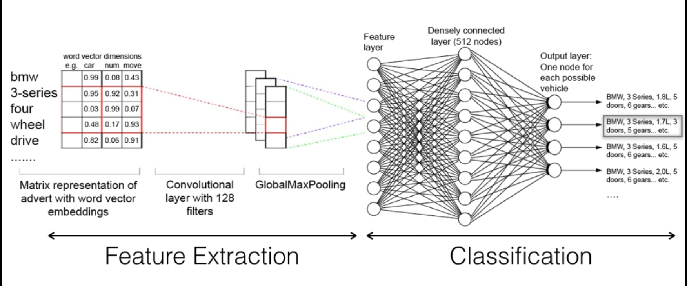

# data-science
Deep learning (imbalanced) classification project to match scraped adverts to products. Case study uses HGV adverts.

1) Scrape advert data to obtain a data to use for advert templates.
2) Process scraped text to generate clean advert text blocks, (clean HTML, concatenate selected and free-text fields, accounting for any missing data).
3) Additional processing step to remove all identifying features from adverts text to produce 'chat-set'.
4) Use 'chat-set' to produce Markov models (language specific).
5) Use product data set to create advert templates consisting of advert data and for each, identify attributes NECESSARY for classification.  
6) Create synthetic adverts using product data interspersed with unique 'chat-text'. 
7) Train deep learning neural network (featuring word vector embeddings, 1D convolutions and GlobalMaxPooling for feature selection, and a deep, densely connected forward feed secion for classification).
8) Test the trained netowrk, producing plots to examine performance and optimal predictive cutoffs.

